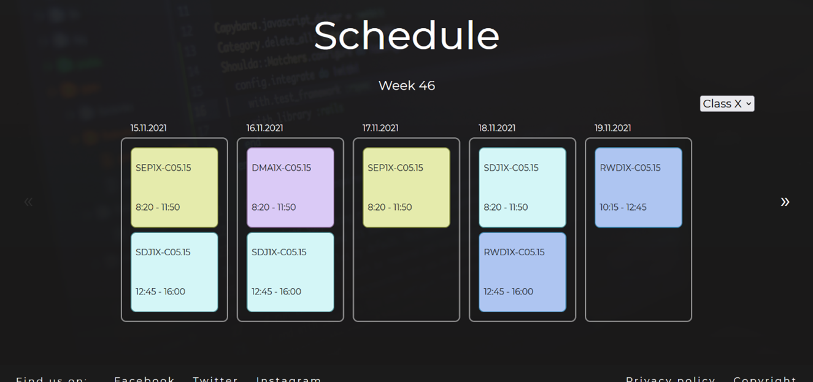
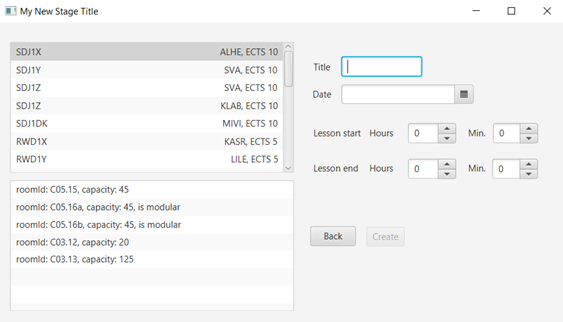

# Intent
The project was made for purpose to simplify the process of creating a schedule, displaying the schedule on to a website. Both administrator and users have user-friendly GUI for accessing or doing relevant actions for their rolls. Waterfall methodology was used for developing this project, keeping the work consistent and optimizing the workflow.

# Process
Technology used for the system was mandatory. The system was created using Java for logic in the background and GUI. For GUI was also used JavaFX library and Scene builder for easier navigations. Website was designed using HTML, CSS and Bootstrap framework. Functionality on the website was created using JavaScript and Glider.js for schedule.

# End Result
The result was a system that has user-friendly GUI that is quick to navigate, easy to understand and able to do most of the required functionality. Being more specific, 17 of 19 requirements are covered which confirms that the system is working correctly. Administrator can quickly change or add new lessons while the students have an easy access to all that information online on the web. The website, including its design, was also, made in order that provide access to view schedule as quickly and as clearly as it is possible. As result, teachers and students are able to find information about the study program, courses, the school and the schedule which is the crucial element.

